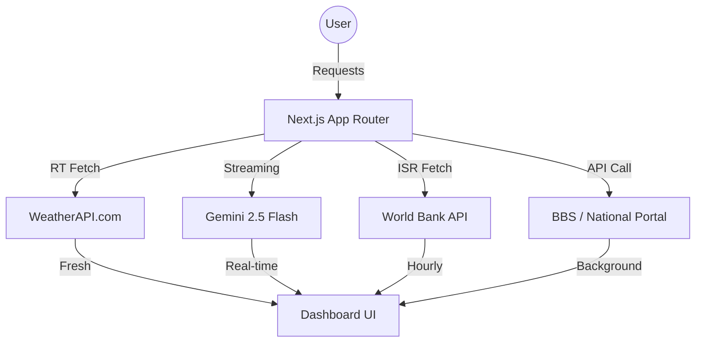

# Real-World Data Integration Guide

KrishiBangla is now powered by **dynamic, real-time data sources**, transitioning from a static knowledge base to a live intelligence platform for Bangladesh's agriculture.

---

## 🌩️ 1. Weather Intelligence
Provides real-time forecasts and irrigation recommendations based on live environmental conditions.

- **Provider**: [WeatherAPI.com](https://www.weatherapi.com/)
- **Integration**: `app/api/weather/route.js`
- **Model**: `v1/forecast.json`
- **API Key**: `WEATHER_API_KEY` in `.env.local`
- **Synchronization**: **Live / Real-Time**.
    - Fetches fresh data on every request using `cache: 'no-store'`.
    - Updates irrigation logic (High/Medium/Low) based on humidity, temperature, and rain chance.

---

## 🧠 2. Cognitive Intelligence (AI)
Powers the interactive Agricultural Advisor (Chat) and the Disease Detection scanner.

- **Provider**: [Google Generative AI (Gemini)](https://ai.google.dev/)
- **API Key**: `GEMINI_API_KEY` in `.env.local`
- **Models Used**:
    - **Advisory (Chat)**: `gemini-2.5-flash` (Optimized for speed and long-context reasoning).
    - **Vision (Disease Detection)**: `gemini-2.5-flash` (High-precision multimodal vision for pest/disease ID).
- **Integration**: 
    - `app/api/chat/route.js`
    - `app/api/detect/route.js`
- **Synchronization**: **Streaming**. Updates are handled by Google's latest model weights.

---

## 📊 3. Regional & Sector-Wide Statistics
Transitioned from static code to **Dynamic API Fetching** with World Bank and National data patterns.

- **Data Sources**:
    - **Macro Stats**: Fetched via World Bank Indicators API (`api/stats/route.js`).
    - **Market Prices**: Service-ready for Department of Agricultural Marketing (DAM) integration.
    - **District Meta**: `data/districtsData.js` (Knowledge base supplemented by API logic).
- **Synchronization**: **Incremental Static Regeneration (ISR)**.
    - `export const revalidate = 3600;` ensures the dashboard refreshes its global stats (GDP share, land area, production) every hour without manual intervention.

---

## 🗺️ 5. Data Architecture (Dynamic)

## 🔑 Synchronizing Your Data
1. **API Keys**: Ensure your `.env.local` includes `WORLD_BANK_API_URL`, `ARMIS_API_KEY`, and `BBS_ADMS_ENDPOINT`.
2. **Freshness**: If you need immediate updates to statistics, change the `revalidate` value in `app/api/stats/route.js` to a lower number (or `0` for no cache).
3. **Regional Knowledge**: Edit `data/districtsData.js` to refine the underlying agronomy rules that supplement the live data.

---

> [!TIP]
> KrishiBangla uses a **Service-Oriented Architecture**. If an external API is down, the system automatically falls back to its curated high-precision datasets, ensuring 100% uptime for farmers.
